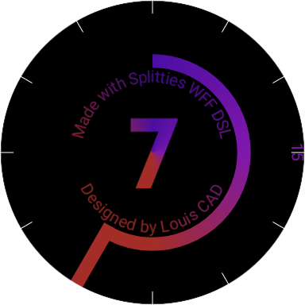
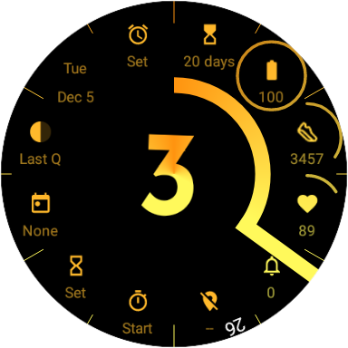
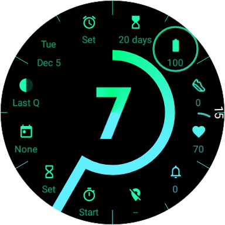
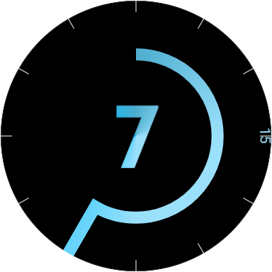

# WFF DSL

Kotlin DSL to generate XML based **Watch Face Format** (WFF) for Wear OS : https://developer.android.com/training/wearables/wff/watch-face

## Example of what you can do with it

This is [Digitalog Sharp](https://play.google.com/store/apps/details?id=com.louiscad.watchface.digitalog.sharp), built with Splitties WFF DSL. Just $3.5 on the Play Store.

## Disclaimer

The API is likely to break in future releases.
That shouldn't prevent you from trying it, but be warned that future upgrades might require code changes.
Also, keep in mind that WFF is quite young and the renderer has bugs. It is unfortunately out of my control.

Feedback on the API and ideas are welcome.

Contributions can be considered, just let me know what you have in mind, or if it's just a small fix,
if you ever find a mistake, you can send a PR directly.

## State of the project

- [x] 100 % of the tags and attributes are implemented
- [x] Typed arithmetic expressions
- [x] Usable
- [x] Higher-level extensions
- [ ] Publication on Maven Central & Gradle Plugins Portal
- [ ] Starter project
- [ ] Documentation
  - [ ] Getting started
  - [ ] Diverse examples
  - [ ] Usage doc
  - [ ] KDoc website
- [ ] Developer experience
  - [ ] Stronger typing of string resources
  - [ ] Stronger typing of drawable/image resources
  - [ ] Generation of typed resources based on files in the directories
  - [ ] Android Studio / IntelliJ IDEA plugin
    - [ ] Colors in the gutter + picker
    - [ ] Automatic refresh of typed resources
    - [ ] New project wizard
  - [ ] Enforce occurrence limits and required child elements
  - [ ] Produce warnings (e.g. when `Thumbnail` is not used)
  - [ ] Higher level libraries (building blocks for effect X or Y)

## Contributing

If you want to contribute to anything, feel free to reach out in the issues (existing or new one).
